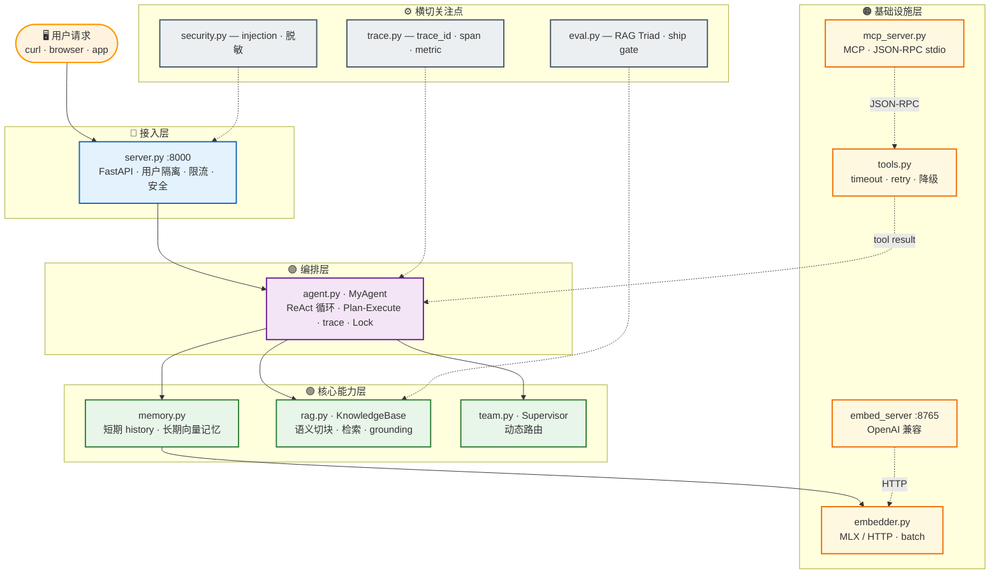

# teammate

从零搭建的生产级 AI Agent —— 从"只会说话"到"能动手、有记忆、能检索、会评估、会规划、能协作、可观测、可部署"。

每一层从零实现（裸写），不用 LangChain 等框架——先理解原理，再用框架。

## 架构图



## 当前进度

| 周 | 级别 | 内容 | 关键文件 |
|---|------|------|---------|
| W1 | L0 | 结构化输出（Pydantic） | — |
| W2 | L0 | Function Calling（多工具循环 + 失败重试） | `tools.py` |
| W3 | L1 | 记忆（短期 history + 长期向量 + MLX embedding） | `memory.py` `embedder.py` |
| W4 | L2 | RAG（语义切块 + batch embed + grounding + 溯源） | `rag.py` `embed_server.py` |
| W5 | L2 | 评估（RAG Triad + LLM-as-judge + ship gate） | `eval.py` |
| W6 | L3 | 规划（Plan-Execute）+ 多 Agent（Supervisor 动态路由） | `team.py` |
| W7 | L4 | MCP（独立进程 JSON-RPC）+ 真工具 + 失败处理 | `mcp_server.py` `tools.py` |
| W8 | L5 | 可观测（trace/token/metric）+ 服务化（FastAPI） | `trace.py` `server.py` |
| W9 | L5/L6 | 用户隔离 + 安全 + 限流 + Docker 部署 | `security.py` `Dockerfile` |

## 技术栈

| 层 | 技术 |
|---|---|
| LLM | GLM-5.2（DashScope Anthropic 兼容端点） |
| Embedding | Qwen3-Embedding-0.6B（MLX 本地 4bit，Apple Silicon） |
| 框架 | FastAPI + Pydantic（不用 LangChain，裸写理解原理） |
| 协议 | MCP（JSON-RPC 2.0 over stdio，从零实现） |
| 存储 | JSON 文件（记忆）+ JSON 文件（知识库向量） |
| 部署 | Docker + docker-compose |
| Python | 3.13 |

## 亮点

1. **从零造了每一层**——不用 LangChain，Agent loop / 记忆 / RAG / eval / MCP / trace 全手写
2. **MCP 从零实现**——JSON-RPC over stdio，踩了 notification 流串行 bug，按 JSON-RPC 2.0 规范修了
3. **真实用驱动暴露的 bug**——mock 工具永远不会触发 OSError 子类 bug / SIGALRM 主线程限制 / 截断配对破坏，只有接真工具 + 服务化才暴露
4. **eval 框架也要被验证**——judge 摸鱼（JSON 截断 → fallback 0.50），0.55 假数据 → 简化 prompt 后真实 0.89
5. **生产架构**——agent 服务和 embedding 服务独立部署（MLX 不能进 Docker 走 HTTP），per-user 隔离 + LRU 淘汰 + 限流 + 安全

详见 [坑日志](docs/坑日志.md)——13 个实战 bug，每个都是"讲一次定位问题经历"的答案。

## 项目结构

```
teammate/
├── src/
│   ├── agent.py        # MyAgent：ReAct 循环 + 记忆 + RAG + trace + Plan-Execute
│   ├── tools.py        # 工具实现 + TOOL_REGISTRY + execute_tool（timeout/retry/降级）
│   ├── memory.py       # VectorMemory：跨 session 向量记忆（余弦召回）
│   ├── rag.py          # KnowledgeBase：RAG pipeline（语义切块 + 检索 + grounding）
│   ├── embedder.py     # Embedder：embedding 后端抽象（HTTP + 本地 MLX + batch）
│   ├── embed_server.py # FastAPI embedding 服务（OpenAI 兼容 /v1/embeddings）
│   ├── mcp_server.py   # MCP server（JSON-RPC over stdio，独立进程）
│   ├── eval.py         # RAG Triad 评估器（LLM-as-judge + 10 题 eval 集 + ship gate）
│   ├── trace.py        # Tracer：trace_id + span + metric（token/延迟/步数）
│   ├── security.py     # 安全防护（prompt injection 检测 + 输出脱敏 + 长度限制）
│   ├── team.py         # 多 Agent 协作（Supervisor 动态路由 + Sequential baseline）
│   ├── server.py       # FastAPI 服务（per-user 隔离 + LRU + 限流 + 安全 + trace）
│   └── chat.py         # 终端交互入口
├── docs/
│   └── 坑日志.md       # 13 个实战 bug（问题定位素材）
├── Dockerfile          # 容器化（不含 MLX，embedding 走 HTTP）
├── docker-compose.yml  # 服务编排（端口 + volume + env）
└── requirements.txt
```

## 快速开始

```bash
python -m venv .venv
.venv/bin/pip install -r requirements.txt
cp .env.example .env   # 填入 API key

# Agent 服务（用户隔离 + 安全 + 限流 + trace）
.venv/bin/python -m src.server
curl -X POST 'localhost:8000/ask?user_id=alice' \
  -H "Content-Type: application/json" -d '{"msg":"你好"}'

# 其他模式
.venv/bin/python -m src.agent         # 多轮对话 + 工具调用
.venv/bin/python -m src.agent rag     # RAG 问答
.venv/bin/python -m src.agent plan    # Plan-Execute 规划
.venv/bin/python -m src.agent mcp     # MCP 独立进程
.venv/bin/python -m src.team          # 多 Agent Supervisor
.venv/bin/python -m src.eval          # RAG 评估成绩单
.venv/bin/python -m src.embed_server  # embedding 服务

# Docker 部署
docker-compose up
```

## 架构演进

```mermaid
flowchart LR
    W1["W1<br/>结构化输出<br/><small>L0</small>"]:::l0
    W2["W2<br/>工具循环<br/><small>L0</small>"]:::l0
    W3["W3<br/>短期+长期记忆<br/><small>L1</small>"]:::l1
    W4["W4<br/>RAG pipeline<br/><small>L2</small>"]:::l2
    W5["W5<br/>RAG 评估<br/><small>L2</small>"]:::l2
    W6["W6<br/>规划+多Agent<br/><small>L3</small>"]:::l3
    W7["W7<br/>MCP+真工具<br/><small>L4</small>"]:::l4
    W8["W8<br/>可观测+服务化<br/><small>L5</small>"]:::l5
    W9["W9<br/>安全+部署<br/><small>L6</small>"]:::l6

    W1 --> W2 --> W3 --> W4 --> W5 --> W6 --> W7 --> W8 --> W9

    classDef l0 fill:#e3f2fd,stroke:#1565c0,stroke-width:2px,color:#333
    classDef l1 fill:#e8f5e9,stroke:#2e7d32,stroke-width:2px,color:#333
    classDef l2 fill:#fff8e1,stroke:#f9a825,stroke-width:2px,color:#333
    classDef l3 fill:#fce4ec,stroke:#c62828,stroke-width:2px,color:#333
    classDef l4 fill:#f3e5f5,stroke:#6a1b9a,stroke-width:2px,color:#333
    classDef l5 fill:#e0f7fa,stroke:#00838f,stroke-width:2px,color:#333
    classDef l6 fill:#efebe9,stroke:#4e342e,stroke-width:2px,color:#333
```


