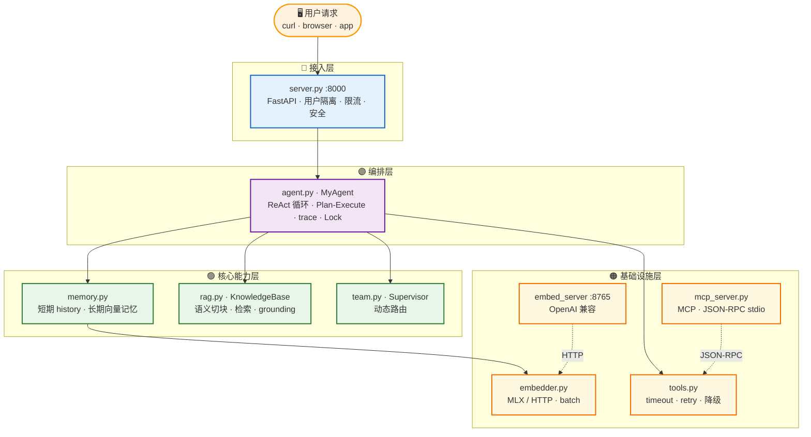

# teammate

从零搭建的生产级 AI Agent —— 从"只会说话"到"能动手、有记忆、能检索、会评估、会规划、能协作、可观测、可部署"。

每一层从零实现（裸写），不用 LangChain 等框架——先理解原理，再用框架。

## 架构图


```mermaid
graph TD
    User(["🖥️ 用户请求<br/>curl · browser · app"]):::user

    subgraph S1["🔵 接入层"]
        Srv["server.py :8000<br/>FastAPI · 用户隔离 · 限流 · 安全"]:::access
    end

    subgraph S2["🟣 编排层"]
        Agent["agent.py · MyAgent<br/>ReAct 循环 · Plan-Execute · trace · Lock"]:::orch
    end

    subgraph S3["🟢 核心能力层"]
        Mem["memory.py<br/>短期 history · 长期向量记忆"]:::core
        RAG["rag.py · KnowledgeBase<br/>语义切块 · 检索 · grounding"]:::core
        Team["team.py · Supervisor<br/>动态路由"]:::core
    end

    subgraph S4["🟠 基础设施层"]
        Emb["embedder.py<br/>MLX / HTTP · batch"]:::infra
        EmbSrv["embed_server :8765<br/>OpenAI 兼容"]:::infra
        Tools["tools.py<br/>timeout · retry · 降级"]:::infra
        MCP["mcp_server.py<br/>MCP · JSON-RPC stdio"]:::infra
    end

    User --> Srv
    Srv --> Agent
    Agent --> Mem
    Agent --> RAG
    Agent --> Team
    Agent --> Tools
    Mem --> Emb
    EmbSrv -.->|HTTP| Emb
    MCP -.->|JSON-RPC| Tools

    classDef user fill:#fff3e0,stroke:#ff9800,stroke-width:2px,color:#333
    classDef access fill:#e3f2fd,stroke:#1565c0,stroke-width:2px,color:#333
    classDef orch fill:#f3e5f5,stroke:#6a1b9a,stroke-width:2px,color:#333
    classDef core fill:#e8f5e9,stroke:#2e7d32,stroke-width:2px,color:#333
    classDef infra fill:#fff8e1,stroke:#ef6c00,stroke-width:2px,color:#333
```

> **横切关注点**（作用于全局，不在图中连线避免布局爆炸）：
> - `trace.py` — trace_id + span + token/延迟/步数（注入 agent.py）
> - `eval.py` — RAG Triad + ship gate baseline（注入 rag.py）
> - `security.py` — injection 检测 + 输出脱敏（注入 server.py）

## 当前进度

| 周 | 级别 | 内容 | 关键文件 |
|---|------|------|---------|
| W1 | L0 | 结构化输出（Pydantic） | — |
| W2 | L0 | Function Calling（多工具循环 + 失败重试） | `tools.py` |
| W3 | L1 | 记忆（短期 history + 长期向量 + MLX embedding） | `memory.py` `embedder.py` |
| W4 | L2 | RAG（语义切块 + batch embed + grounding + 溯源） | `rag.py` `embed_server.py` |
| W5 | L2 | 评估（RAG Triad + LLM-as-judge + ship gate） | `eval.py` |
| W6 | L3 | 规划（Plan-Execute）+ 多 Agent（Supervisor 动态路由） | `team.py` |
| W7 | L4 | MCP（独立进程 JSON-RPC）+ 真工具 + 失败处理 | `mcp_server.py` `tools.py` |
| W8 | L5 | 可观测（trace/token/metric）+ 服务化（FastAPI） | `trace.py` `server.py` |
| W9 | L5/L6 | 用户隔离 + 安全 + 限流 + Docker 部署 | `security.py` `Dockerfile` |

## 技术栈

| 层 | 技术 |
|---|---|
| LLM | GLM-5.2（DashScope Anthropic 兼容端点） |
| Embedding | Qwen3-Embedding-0.6B（MLX 本地 4bit，Apple Silicon） |
| 框架 | FastAPI + Pydantic（不用 LangChain，裸写理解原理） |
| 协议 | MCP（JSON-RPC 2.0 over stdio，从零实现） |
| 存储 | JSON 文件（记忆）+ JSON 文件（知识库向量） |
| 部署 | Docker + docker-compose |
| Python | 3.13 |

## 亮点

1. **从零造了每一层**——不用 LangChain，Agent loop / 记忆 / RAG / eval / MCP / trace 全手写
2. **MCP 从零实现**——JSON-RPC over stdio，踩了 notification 流串行 bug，按 JSON-RPC 2.0 规范修了
3. **真实用驱动暴露的 bug**——mock 工具永远不会触发 OSError 子类 bug / SIGALRM 主线程限制 / 截断配对破坏，只有接真工具 + 服务化才暴露
4. **eval 框架也要被验证**——judge 摸鱼（JSON 截断 → fallback 0.50），0.55 假数据 → 简化 prompt 后真实 0.89
5. **生产架构**——agent 服务和 embedding 服务独立部署（MLX 不能进 Docker 走 HTTP），per-user 隔离 + LRU 淘汰 + 限流 + 安全

详见 [坑日志](docs/坑日志.md)——13 个实战 bug，每个都是"讲一次定位问题经历"的答案。

## 项目结构

```
teammate/
├── src/
│   ├── agent.py        # MyAgent：ReAct 循环 + 记忆 + RAG + trace + Plan-Execute
│   ├── tools.py        # 工具实现 + TOOL_REGISTRY + execute_tool（timeout/retry/降级）
│   ├── memory.py       # VectorMemory：跨 session 向量记忆（余弦召回）
│   ├── rag.py          # KnowledgeBase：RAG pipeline（语义切块 + 检索 + grounding）
│   ├── embedder.py     # Embedder：embedding 后端抽象（HTTP + 本地 MLX + batch）
│   ├── embed_server.py # FastAPI embedding 服务（OpenAI 兼容 /v1/embeddings）
│   ├── mcp_server.py   # MCP server（JSON-RPC over stdio，独立进程）
│   ├── eval.py         # RAG Triad 评估器（LLM-as-judge + 10 题 eval 集 + ship gate）
│   ├── trace.py        # Tracer：trace_id + span + metric（token/延迟/步数）
│   ├── security.py     # 安全防护（prompt injection 检测 + 输出脱敏 + 长度限制）
│   ├── team.py         # 多 Agent 协作（Supervisor 动态路由 + Sequential baseline）
│   ├── server.py       # FastAPI 服务（per-user 隔离 + LRU + 限流 + 安全 + trace）
│   └── chat.py         # 终端交互入口
├── docs/
│   └── 坑日志.md       # 13 个实战 bug（问题定位素材）
├── Dockerfile          # 容器化（不含 MLX，embedding 走 HTTP）
├── docker-compose.yml  # 服务编排（端口 + volume + env）
└── requirements.txt
```

## 快速开始

```bash
python -m venv .venv
.venv/bin/pip install -r requirements.txt
cp .env.example .env   # 填入 API key

# Agent 服务（用户隔离 + 安全 + 限流 + trace）
.venv/bin/python -m src.server
curl -X POST 'localhost:8000/ask?user_id=alice' \
  -H "Content-Type: application/json" -d '{"msg":"你好"}'

# 其他模式
.venv/bin/python -m src.agent         # 多轮对话 + 工具调用
.venv/bin/python -m src.agent rag     # RAG 问答
.venv/bin/python -m src.agent plan    # Plan-Execute 规划
.venv/bin/python -m src.agent mcp     # MCP 独立进程
.venv/bin/python -m src.team          # 多 Agent Supervisor
.venv/bin/python -m src.eval          # RAG 评估成绩单
.venv/bin/python -m src.embed_server  # embedding 服务

# Docker 部署
docker-compose up
```

## 架构演进


```mermaid
graph LR
    W1["W1 结构化输出 L0"]:::l0
    W2["W2 工具循环 L0"]:::l0
    W3["W3 短期+长期记忆 L1"]:::l1
    W4["W4 RAG pipeline L2"]:::l2
    W5["W5 RAG 评估 L2"]:::l2
    W6["W6 规划+多Agent L3"]:::l3
    W7["W7 MCP+真工具 L4"]:::l4
    W8["W8 可观测+服务化 L5"]:::l5
    W9["W9 安全+部署 L6"]:::l6

    W1 --> W2 --> W3 --> W4 --> W5 --> W6 --> W7 --> W8 --> W9

    classDef l0 fill:#e3f2fd,stroke:#1565c0,stroke-width:2px,color:#333
    classDef l1 fill:#e8f5e9,stroke:#2e7d32,stroke-width:2px,color:#333
    classDef l2 fill:#fff8e1,stroke:#f9a825,stroke-width:2px,color:#333
    classDef l3 fill:#fce4ec,stroke:#c62828,stroke-width:2px,color:#333
    classDef l4 fill:#f3e5f5,stroke:#6a1b9a,stroke-width:2px,color:#333
    classDef l5 fill:#e0f7fa,stroke:#00838f,stroke-width:2px,color:#333
    classDef l6 fill:#efebe9,stroke:#4e342e,stroke-width:2px,color:#333
```

---

## Stage 3: Harness Demo（参照 Claude Code）

### 5 核心组件映射

| 组件 | Claude Code | teammate 实现 | 文件:行号 |
|---|---|---|---|
| Agent Loop | while True + stop_reason | for step in range + stop_reason | `agent.py:188` |
| Tool Registry | TOOL_HANDLERS dispatch | TOOL_REGISTRY + execute_tool | `tools.py:136,334` |
| Permission Gate | PreToolUse hook + deny/ask/allow | 三道闸门 + permission_hook | `tools.py:225,276,314` |
| Session Store | context window + auto memory | VectorMemory (SQLite) + self.history | `memory.py:12`, `agent.py:134` |
| Context Compaction | multi-layer compact | snipCompact + LLM summaryCompact | `agent.py:340` |

### Claude Code 设计哲学对照

| 原则 | teammate 证据 |
|---|---|
| 模型=智能 Harness=环境 | agent loop 只执行不决策，LLM 决定调什么工具 |
| 一个 loop 不改变 | 加了 permission/hooks/subagent/compact，loop 结构未变 |
| 扩展不修改只注册 | register_hook() 加功能，execute_tool 不改 |
| 一机制一件事 | permission/hooks/subagent 各自独立 |
| 渐进复杂度 | W1→W2→...→research 逐步加，每步独立可跑 |
| Harness 质量决定上限 | 同 GLM-5.2，DEFAULT vs RESEARCH_SYSTEM 能力不同 |
| Agent≠Workflow | research() 只给方向，具体怎么做 LLM 自己决定 |

### 运行步骤

```bash
cd teammate
.venv/bin/pip install -r requirements.txt
cp .env.example .env  # 填 ANTHROPIC_API_KEY

# 研究助手（Stage 2 产出）
.venv/bin/python -m src.agent research "RAG检索增强生成技术"

# 多轮对话（短期记忆验证）
.venv/bin/python -m src.agent

# RAG 知识库问答
.venv/bin/python -m src.agent rag

# Plan-Execute
.venv/bin/python -m src.agent plan
```

### 示例输入输出

输入：`.venv/bin/python -m src.agent research "RAG检索增强生成技术"`

输出：8 章节 RAG 研究报告，每段带 `[来源:URL]` 引用，末尾 14 条参考链接。
- 5 轮 agent 循环：2× web_search + 5× fetch_url
- 工具调用日志通过 Tracer 输出（trace_id + event + timestamp）

### 失败记录

| 失败 | 原因 | 处理 | 代码位置 |
|---|---|---|---|
| web_search 超时 | DuckDuckGo 响应 >10s | per-tool timeout 调到 30s | `tools.py:179` |
| fetch_url 403 | 知乎/Medium 反爬 | 错误回灌给 LLM，自动换源 | `tools.py:119` |
| read_file .env | 敏感文件 | DENY_PATTERNS 拦截 | `tools.py:225` |
| read_file /tmp | 工作区外 | safe_path 拦截 + 非交互自动拒 | `tools.py:248` |
| 重复工具调用 | LLM 循环调同参数 | seen_calls 检测跳过 | `agent.py:184,226` |
| max_tokens 截断 | 4096 不够写完报告 | research 模式调到 8192 | `agent.py:157` |

### learn-claude-code 机制对照（s01-s20）

| 课 | 机制 | teammate | 证据 |
|---|---|---|---|
| s01 | Agent Loop | ✅ | agent.py:188 |
| s02 | Tool Use | ✅ | tools.py:136 |
| s03 | Permission | ✅ | tools.py:225-287 |
| s04 | Hooks | ✅ | tools.py:295-331 |
| s05 | TodoWrite | ⚠️ | agent.py:284 plan_and_execute |
| s06 | Subagent | ✅ | agent.py spawn_subagent |
| s07 | Skill Loading | ❌ | — |
| s08 | Context Compact | ✅ | agent.py:340 snip+LLM summary |
| s09 | Memory | ⚠️ | memory.py VectorMemory (无固化/遗忘) |
| s10 | System Prompt | ✅ | agent.py load_system_prompt() |
| s11 | Error Recovery | ⚠️ | tools.py:213 retry (无 fallback model) |
| s19 | MCP | ✅ | agent.py:51 MCPClient |
| s20 | Comprehensive | — | 目标 |

**完成度：9/11（s07/s11 待做，s05/s09 部分实现）**

---

## Stage 4: 多 Agent 协作（参照 cat-cafe）

> 设计文档：[`docs/stage4-1-role-taxonomy.md`](docs/stage4-1-role-taxonomy.md)

### 4 阶段里程碑

| 阶段 | 内容 | 状态 |
|---|---|---|
| **4.1 角色与接口** | 5 角色（planner/executor/reviewer/critic/router）+ AgentBase I/O schema + 停止条件 + Team Roster 设计 | ✅ 设计完成 |
| **4.2 外部 Agent 集成** | 实现 AgentIdentity/Task/TaskResult + 改 base.py + MyAgent 实现新接口 + team_roster.json + Roster 加载器 | ⏳ 下一步 |
| **4.3 Thread + @mention 路由** | 建 thread store + 行首 @ parser + supervisor router（深度参照 cat-cafe F043） | ⏳ |
| **4.4 共享记忆 + 任务追踪** | cross-agent evidence store + persistent tasks + hold/wait | ⏳ |
| **4.5 评估 + 单 Agent 退化** | 产出 research→write→review→revise，router 能判断单 agent 够用 | ⏳ |

### 三层身份模型（参照 cat-cafe F032）

| 维度 | 含义 | teammate 例 |
|---|---|---|
| Family | 接入通道 / 模型家族 | myagent / codex / claude-code |
| Individual | 具体一个 agent 实例 | myagent-1 / codex-1 / cc-1 |
| Role | 干什么活 | planner / executor / reviewer / critic / router |

代码必经 砚砚(@缅因猫) 跨族 review（家规铁律 2）。

